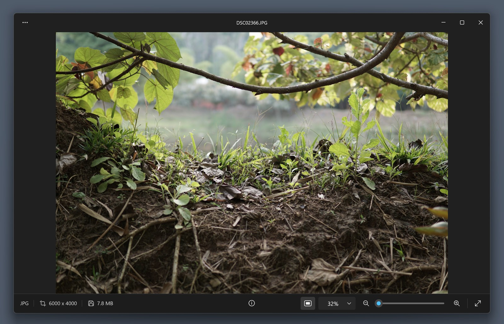

# images

Images app for Windows — a fast, minimal photo viewer that looks and feels like the Windows 11 Photos app, without the wait.

Native Win32 + Direct2D + WIC in Rust: a ~480 KB exe that opens a photo in about 100 ms.




## Download

From the [latest release](https://github.com/sidx1024/images/releases/latest) (Windows 10 1903+ / Windows 11, x64):

- **`images-<version>-x64.msi`** — the installer (recommended). Installs for your user only, no admin prompt: adds Images to the Start menu, Explorer's "Open with" menu and Settings > Default apps. Uninstall from Settings > Apps > Installed apps; installing a newer version upgrades in place.
- **`images.exe`** — portable: a single exe, nothing to install. See [Open with / default app](#open-with--default-app) to register it by hand.

`SHA256SUMS.txt` on the release lets you verify the download. The files aren't code-signed yet, so Windows SmartScreen may say "Windows protected your PC" the first time: choose **More info → Run anyway**.

## Features

- **Viewing**: any format Windows has a codec for (JPEG, PNG, GIF, WebP, HEIC/AVIF, camera RAW, …), EXIF orientation, embedded color profiles converted to sRGB.
- **Pan & zoom**: wheel zoom at the cursor, drag to pan, double-click to toggle fit/100%, smooth eased zoom, zoom slider and presets, persistent *Fit to window* mode.
- **Navigation**: ←/→ through the folder in Explorer's order (including an open Explorer window's sort), with neighbors prefetched for instant switching.
- **Info drawer** (`I`): dimensions, size, dpi, bit depth, date taken, camera, lens, exposure, and a link that reveals the file in Explorer.
- **Photos-style chrome**: custom title bar with Snap Layouts, status bar, light/dark/system theme, high contrast, text scaling, touch gestures.
- **Actions**: Ctrl+C copies the image, Delete moves it to the Recycle Bin (with optional confirmation), F11 fullscreen.
- Remembers window size/position, theme and view preferences.
- **No AI features**: no cloud, no accounts, no telemetry; your photos never leave your PC.

## Build

Requires Rust (MSVC toolchain) and the Windows SDK (for `rc.exe`, used to embed the icon).

```
cargo build --release
```

The binary is `target\release\images.exe`. Run it with a file path, or open it and press Ctrl+O.

## Open with / default app

The MSI installer and the Store package do this for you. For the portable exe, copy `images.exe` somewhere permanent (for example `%LOCALAPPDATA%\Programs\Images\`), then register it for the current user (no admin needed):

```
images.exe --register     # adds it to "Open with" and Settings > Apps > Default apps
images.exe --unregister   # removes the registration
```

Windows only lets the user choose default apps, so pick Images in **Settings > Apps > Default apps** — or use *Set as default…* in the app's own Settings page, which opens Images' page there directly.

## Tests

```
cargo test --release
```

## Packaging

Both packages register the file types in [`packaging/extensions.txt`](packaging/extensions.txt).

- **MSI installer** ([WiX Toolset](https://wixtoolset.org) v5, per-user): `dotnet tool install --global wix --version 5.0.2`, then `.\packaging\build-msi.ps1`.
- **MSIX package** (Microsoft Store): `.\packaging\build-msix.ps1` (needs the Windows SDK). In the package, Windows owns the file-type registration through the manifest, so `--register` is a no-op and *Set as default…* opens the package's page in Default apps (on Windows 11; Windows 10 opens the main Default apps page).

### Publishing to the Microsoft Store

1. Reserve the name *Images* (or another) in [Partner Center](https://partner.microsoft.com/dashboard) and open **Product identity**.
2. Set the repository variables `MSIX_IDENTITY_NAME` (Package/Identity/Name), `MSIX_PUBLISHER` (Package/Identity/Publisher, `CN=…`) and `MSIX_PUBLISHER_DISPLAY_NAME` (plus `MSIX_DISPLAY_NAME` if you reserved a name other than *Images*), or pass them to `build-msix.ps1` as `-IdentityName`, `-Publisher`, `-PublisherDisplayName` and `-DisplayName`. The Store rejects versions starting with 0, so bump `Cargo.toml` to 1.0.0 (or pass `-Version 1.0.0.0`) for the first submission.
3. Upload the `images-store-msix` artifact from the release workflow run as the submission's package. The Store signs it. The app declares the `runFullTrust` capability (every packaged Win32 app does), which the submission asks you to justify: "Images is a native Win32 desktop app."
4. Optionally check it locally first with the Windows App Certification Kit (`appcert.exe`, in the Windows SDK; run as administrator).

## Releasing

Bump `version` in `Cargo.toml`, commit, then tag and push. GitHub Actions builds and tests, publishes the release (`images.exe`, the MSI, a zip and checksums) and attaches the Store MSIX to the workflow run:

```
git tag v0.1.0
git push origin v0.1.0
```
